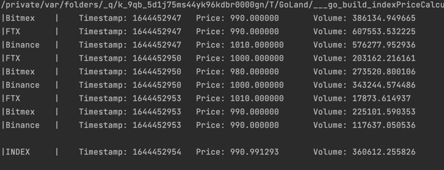
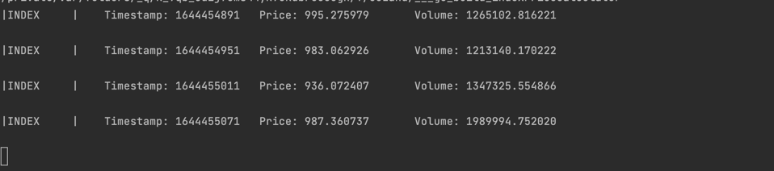

#Index price calculater  
This program implementing composite index for ticker from different sources  

##Description
I chose a [weighted arithmetic mean](https://en.wikipedia.org/wiki/Weighted_arithmetic_mean) as the algorithm for calculating the index price per coin.  

The main idea of such a solution:  
`An exchange where a larger trading volume provides the most fair price`  

As far as I understand, the same approach is used by the [.BXBT](https://www.bitmex.com/app/index/.BXBT) composite index on the [BitMex](https://www.bitmex.com/) exchange      
  
  
Mock sources and index provider are configurable, so you can play with them 

##Some examples
This screenshot shows an example of an output with exchanges that send their data every 3 seconds and an index that counts every 10 seconds. Small values were chosen so that the example was clear and did not take up much space  

Also, an example without the output of exchange data with an index that is counted every minute, as it was in the requirements of the test task  

##Changes from requirements  
• Added **Volume** field to TickerPrice, for algorithm calculations.   
• Added **context.Context** as parameter to subscription for maintaining goroutines and prevent possible leaks  
• It's configurable should subscriber end it's work in case of error or not
